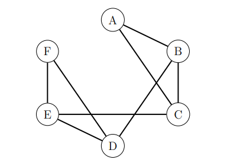
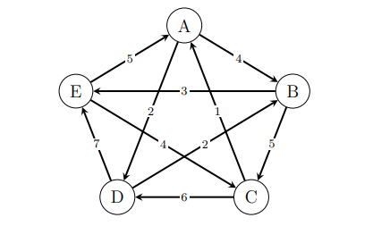
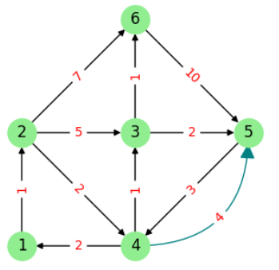

# Ôn tập Toán rời rạc theo đúng dạng đề thi

---


# Chương 2: Lý thuyết đồ thị

## 1. Các khái niệm cơ bản
- Đồ thị là một Cấu trúc rời rạc bao gồm các đỉnh và các cạnh nối các đỉnh này.

### 1.1. Các loại đồ thị
#### **Đồ thị vô hướng**
<p><b style="color:teal">Định nghĩa:</b> Đơn (đa) đồ thị vô hướng $G = (V,E)$ là cặp gồm:
<li>Tập đỉnh $V$ hữu hạn phần tử, các phần tử gọi là các đỉnh</li>
<li>Tập cạnh $E$ các bộ không có thứ tự dạng $(u,v)$ với $u,v\in V$ và $u\neq v$</li></p>
<ul>
<li>G: Graph, V: vertex, E: edge</li>
<li>Đa đồ thị là đồ thị có cạnh lặp, tức là nhiều hơn 1 cạnh nối 2 đỉnh</li>
</ul>

<table >
<tr>
<td ></td>
<td></td>
</tr>
</table>

<table >
<tbody>
<tr>
<td><b>1. Đồ thị $G_1=(V_1,E_1)$</b>
<li>$V_1=\{a,b,c,d,e,f,g,h\}$</li>
<li>$E_1=\{(a,b),\,(b,c),\,(c,d),\,(d,a),\,(a,e),\,(d,b),\,(d,e),\,(f,g)\}$</li>
<b>2. Thuật ngữ:</b>
<li>Tập các đỉnh (nút)</li>
<li>Tập các cạnh (vô hướng)</li>
<li>Gọi $j\in E_1$ là cạnh $(a,b)$:<br/>
<ul>
<li>$a$, $b$: kề nhau/lân cận/nối với nhau; các đầu mút của $j$</li>
<li>$j$: liên thuộc/nối $a$ và $b$</li>
</ul>
</li></td>
<td style="width: 35%; text-align: center;"></td>
</tr>
</tbody>
</table>

<table>
<tr>
<td>
<b>Đồ thị $G_2=(V_2,E_2)$</b>
<p><li>$V_2=\{a,b,c,d,e,f,g,h\}$</li>
<br>
<li>$E_2=\{(a,b),\,(b,c),(b,c),\,(c,d),\,(d,a),\,(a,e),\,(a,e),(a,e),\,(d,b),\,(d,e),\,(f,g)\}$</li></br></p>
</td>
<td style="width: 35%; text-align: center;"></td>
</tr>
</table>

#### **Đồ thị có hướng**
<p><b style="color:teal">Định nghĩa:</b> Đơn (đa) đồ thị có hướng $G = (V,E)$ là cặp gồm:
<li>Tập đỉnh $V$ hữu hạn phần tử, các phần tử gọi là các đỉnh</li>
<li>Tập cạnh $E$ các bộ có thứ tự dạng $(u,v)$ với $u,v\in V$ và $u\neq v$</li></p>

<table>
<tr>
<td style="width: 65%; text-align: left;"><p><b>1. Đơn đồ thị có hướng</b></p>
<p><li>$V=\{u,v,w\}$</li>
<li>$E=\{(v,u),\,(w,u)\}$</li></p>
<p><b>2. Thuật ngữ:</b></p>
<p><li>Tập các đỉnh (nút)</li>
<li>Tập các cạnh (có hướng)</li>
<li>Gọi $j\in E$ là cạnh (cung) $(v,u)$:<br/>
<ul style="list-style-type: circle;">
<li>$v$ và $u$ kề nhau hoặc $v$ là kề tới $u$ hoặc $u$ là kề từ $v$</li>
<li>$j$ đi ra khỏi $v$ và $j$ đi vào $u$ hoặc $j$ nối $v$ với $u$ hoặc $j$ đi từ $v$ tới $u$</li>
<li>$v$ là đỉnh đầu của $j$, $u$ là đỉnh cuối của $j$</li>
</ul>
</li></p></td>
<td style="width: 35%; text-align: center;"></td>
</tr>
</table>

<table>
<tr>
<td></td>
<td><p><b>Đơn đồ thị có hướng</b>
<p><li>$V=\{u,v,w\}$</li>
<li>$E=\{(v,u),\,(w,u),\,(u,v)\}$</li></p></p>
</td>
</tr>
<tr>
<td>
<p></p>
</td>
<td>
<p><b>Đa đồ thị có hướng</b>
<p><li>$V=\{u,v,w\}$</li>
<li>$E=\{(u,v),\,(w,u),\,(u,v)\}$</li></p></p></td>
</tr>
<tr>
<td>
<p><b style="color:red">Chú ý:</b></p>
<p><li>Cạnh <b>khuyên</b> (cạnh nối 1 đỉnh với chính nó): </li>
<li>Giả đồ thị: là đa đồ thị mà trong đó có các <b>khuyên</b></li></p>
</td>
<td>
</td>
</tr>
</table>

### 1.2. Bậc của đỉnh 

<h2>Đồ thị vô hướng</h2>
<p>Giả sử $G$ là đồ thị vô hướng và $v\in V$</p>
<li>Bậc của đỉnh $v$, <span style="color:red">deg$(v)$</span>, là số cạnh kề với nó</li>
<li>Đỉnh bậc 0 được gọi là <b>đỉnh cô lập</b></li>
<li>Đỉnh bậc 1 được gọi là <b>đỉnh treo</b></li>
<li>Các kí hiệu: $\delta(G)=\min\limits_{v\in V}\text{deg}(v)$ và $\Delta(G)=\max\limits_{v\in V}\text{deg}(v)$</li>
<p></p>
<li>Đỉnh cô lập: $h$ </li>
<li>Đỉnh treo: $g$, $f$</li>
<li>$\delta(G)=0$, $\Delta(G)=4=\text{deg}(d)$</li>
<p><b style="color:blue">Định lí (cái bắt tay):</b> Giả sử $G$ là đồ thị vô hướng (đơn hoặc đa) với tập đỉnh $V$ và tập cạnh $E$. Khi đó $$\sum\limits_{v\in V}\text{deg}(v)=2|E|.$$</p>
<p>Mỗi cạnh của đồ thị sẽ được tính 1 lần trong deg(u) và 1 lần trong deg(v).</p>
<p><b style="color:red">Hệ quả:</b> Trong một đồ thị vô hướng bất kỳ, số lượng đỉnh bậc lẻ (đỉnh có bậc là số lẻ) bao giờ cũng là số chẵn.</p>
<p>Chia thành 2 nhóm (bậc lẻ và bậc chẵn), khi đó tổng bậc của nhóm bậc chẵn là số chẵn, suy ra tổng bậc của nhóm bậc lẻ cũng là số chẵn. Để tổng của các số lẻ bằng số chẵn thì số lượng số hạng phải là số chẵn, hay số lượng đỉnh bậc lẻ là số chẵn.</p>
<p><b style="color:red">Ví dụ:</b> Một đồ thị vô hướng có 14 đỉnh và 25 cạnh. Biết mỗi đỉnh là bậc 3 hoặc bậc 5, hỏi đồ thị này có bao nhiêu đỉnh bậc 3? (ĐS: 10)</p>
<p>Gọi $x$ là số đỉnh bậc 3 thì $14-x$ là số đỉnh bậc 5. Khi đó $3x+5(14-x)=2.25=50$, suy ra $x=10$.</p>
<h2>Đồ thị có hướng</h2>
<p>Giả sử $G$ là đồ thị có hướng và $v\in V$</p>
<li>Bán bậc vào của $v$, <span style="color:red">deg$^-(v)$</span>, là số cạnh đi vào $v$</li>
<li>Bán bậc ra của $v$, <span style="color:red">deg$^+(v)$</span>, là số cạnh đi ra khỏi $v$</li>
<li>$\text{deg}(v):=\text{deg}^-(v)+\text{deg}^+(v)$</li>
<p></p>
<ul>
<li>Đỉnh $a$ (đỉnh nguồn): $\text{deg}^-(a)=0$, $\text{deg}^+(a)=2$</li>
<li>Đỉnh $b$: $\text{deg}^-(b)=1$, $\text{deg}^+(b)=1$</li>
<li>Đỉnh $c$: $\text{deg}^-(c)=1$, $\text{deg}^+(c)=2$</li>
<li>Đỉnh $d$: $\text{deg}^-(d)=2$, $\text{deg}^+(d)=1$</li>
<li>Đỉnh $e$ (đỉnh đích): $\text{deg}^-(e)=2$, $\text{deg}^+(e)=0$</li>
<li>Đỉnh $f$: $\text{deg}^-(f)=\text{deg}^+(f)=0$</li>
</ul>
<p><b style="color:blue">Định lí (cái bắt tay):</b> Giả sử $G$ là đồ thị cô hướng (đơn hoặc đa) với tập đỉnh $V$ và tập cạnh $E$. Khi đó $$\sum\limits_{v\in V}\text{deg}^-(v)=\sum\limits_{v\in V}\text{deg}^+(v)=\dfrac{1}{2}\sum\limits_{v\in V}\text{deg}(v)=|E|.$$</p>
<p>Mỗi cạnh $(u,v)$ của đồ thị được tính 1 lần ở bán bậc ra của đỉnh $u$ và 1 lần ở bán bậc vào của đỉnh $v$</p>
<p><b style="color:red">Chú ý:</b> Ta có $\sum\limits_{v\in V}\text{deg}(v)=2|E|$, do đó khái niệm bậc của đỉnh là không thay đổi cho dù ta xét đồ thị vô hướng hay có hướng.</p>


## 2. Biểu diễn đồ thị

### 2.1. Cách biểu diễn đồ thị từ ma trận
```text
          j - cột
              A   B   C
i - hàng  A   0   2   0
          B   2   0   5
          C   0   5   0
```

#### Đồ thị vô hướng có trọng số
- Ma trận đối xứng: `aij = aji`.
- Nếu `aij ≠ 0` thì có cạnh `(vi, vj)` với trọng số `aij`.
- Nếu `aij = 0` thì không có cạnh.

#### Đồ thị có hướng có trọng số
- Ma trận không cần đối xứng.
- Nếu `aij ≠ 0` thì có cung `vi -> vj` với trọng số `aij`.
- Nếu `aij = 0` thì không có cung.

**Khi đề cho ma trận kề hoặc ma trận trọng số và yêu cầu vẽ lại đồ thị, làm theo quy trình sau:**
1. Đọc thứ tự hàng và cột để xác định tập đỉnh và tập cạnh.
  - Ví dụ: hàng 1 là đỉnh A, hàng 2 là đỉnh B, v.v.
  - Nếu đề không cho thứ tự, mặc định theo thứ tự chữ cái.
  -> Tập đỉnh: $V=\{a,b,c,d,e,f,g,h\}$ - Một hàng hoặc cột tương ứng với một đỉnh.
  -> Tập cạnh: $E_1=\{(a,b),\,(b,c),\,(c,d),\,(d,a),\,(a,e),\,(d,b),\,(d,e),\,(f,g)\}$ - Mỗi ô `aij` khác 0 tương ứng với một cạnh/cung giữa đỉnh `i` và `j`.

2. Xác định đồ thị vô hướng hay có hướng:
   - Ma trận đối xứng thường là đồ thị vô hướng.
   - Ma trận không đối xứng thường là đồ thị có hướng.
3. Xác định có trọng số hay không:
   - Nếu ngoài đường chéo có các số khác 0, 1 thì đó là trọng số.
   - Nếu chỉ có 0 và 1 thì là ma trận kề không trọng số.
4. Duyệt từng ô `aij`:
   - Nếu `aij = 0` thì không vẽ cạnh/cung.
   - Nếu `aij ≠ 0` thì vẽ cạnh/cung tương ứng.
5. Với đồ thị vô hướng:
   - Chỉ cần xét nửa trên hoặc nửa dưới ma trận để tránh vẽ lặp.
   - Mỗi cạnh xuất hiện ở hai ô đối xứng.
6. Với đồ thị có hướng:
   - Mỗi ô `aij` tương ứng đúng một cung `vi -> vj`.
7. Ghi trọng số lên cạnh/cung nếu đề cho trọng số.

### 2.2. Cách biểu diễn ma trận từ đồ thị

#### Với đồ thị vô hướng
- Ghi trọng số của cạnh vào cả hai ô `(i, j)` và `(j, i)`.
- Đường chéo chính thường là `0`.

#### Với đồ thị có hướng
- Chỉ ghi trọng số vào ô `(i, j)` nếu có cung `i -> j`.
- Ô `(j, i)` có thể khác hoặc bằng 0 tùy đồ thị.

**Khi đã có đồ thị và cần viết lại ma trận:**
1. Chọn thứ tự đỉnh cố định, thường là `A, B, C, ...`.
2. Lập ma trận theo đúng thứ tự đó.
3. Với đồ thị vô hướng:
   - Nếu có cạnh giữa `vi` và `vj` thì ghi vào cả `aij` và `aji`.
   - Nếu không có cạnh thì ghi `0`.
4. Với đồ thị có hướng:
   - Nếu có cung `vi -> vj` thì ghi vào `aij`.
   - Nếu không có cung thì ghi `0`.
5. Đường chéo chính thường là `0` nếu không có khuyên.

## 3. Các thuật toán duyệt đồ thị

**Đồ thị vô hướng**
Khi duyệt từ một đỉnh, bạn được phép đi sang mọi đỉnh kề với nó.
Cạnh (A, B) nghĩa là đi được cả A -> B và B -> A.
**Đồ thị có hướng**
Khi duyệt từ một đỉnh, bạn chỉ đi theo chiều mũi tên ra.
Nếu có cung A -> B thì đi được từ A sang B, nhưng không tự động đi ngược lại.

<table style="border-collapse:collapse; text-align:center;">
  <tr>
    <td>Đồ thị vô hướng</td>
    <td>Đồ thị có hướng</td>
  </tr>
  <tr>
    <td></td>
    <td></td>
  </tr>
</table>


### 3.1. BFS (Breadth-First Search)
- Duyệt theo từng lớp mức.
- Dùng hàng đợi `Queue`.
- Đỉnh nào vào hàng đợi trước thì xử lý trước.

1. Đánh dấu đỉnh xuất phát đã thăm.
2. Đưa đỉnh xuất phát vào queue.
3. Lấy đỉnh đầu queue ra, xét các đỉnh kề chưa thăm.
4. Đỉnh nào chưa thăm thì đánh dấu và đưa vào queue.
5. Lặp đến khi queue rỗng.

Duyệt từ đỉnh `A`:
-> Đồ thị vô hướng: A -> B -> C -> D -> E -> F
-> Đồ thị có hướng: A -> B -> D -> C -> E

### 3.2. DFS (Depth-First Search)
- Đi sâu hết mức có thể rồi quay lui.
- Dùng stack hoặc đệ quy.

1. Đánh dấu đỉnh xuất phát đã thăm.
2. Chọn đỉnh kề chưa thăm theo thứ tự chữ cái.
3. Đi tiếp từ đỉnh đó.
4. Khi hết đường đi thì quay lui.

Duyệt từ đỉnh `A`:
-> Đồ thị vô hướng: A -> B -> C -> E -> D -> F
-> Đồ thị có hướng: A -> B -> C -> D -> E

## 4. Chu trình và đường đi Euler

### 4.1. Định nghĩa

- **Đường đi Euler**: Là một đường đi đi qua tất cả các cạnh đúng 1 lần.
- **Chu trình Euler**: Là đường đi Euler nhưng điểm đầu = điểm cuối.
- **Đồ thị nửa Euler**: có đường đi Euler nhưng không có chu trình Euler.
- **Đồ thị Euler**: có chu trình Euler.

### 4.2. Điều kiện cho đồ thị vô hướng liên thông

- Có **chu trình Euler** `<=>` mọi đỉnh đều có bậc chẵn.
- Có **đường đi Euler** `<=>` có đúng **2 đỉnh bậc lẻ**.

- Bậc của đỉnh: số cạnh nối với đỉnh đó.
- Ví dụ:
  - Đỉnh A nối với B, C, D thì: `deg(A) = 3`
  - Hàng i của đỉnh i: `deg(i) = số phần tử khác 0 trong hàng đó`

### 4.3. Điều kiện cho đồ thị có hướng liên thông yếu

- `deg+(v)` = số cung đi ra khỏi `v`
- `deg-(v)` = số cung đi vào `v`

- Có **chu trình Euler** `<=>` `deg-(v) = deg+(v)` với mọi đỉnh `v`.
- Có **đường đi Euler** `<=>`:
  - tồn tại đúng 1 đỉnh `u` sao cho `deg+(u) - deg-(u) = 1`,
  - tồn tại đúng 1 đỉnh `v` sao cho `deg-(v) - deg+(v) = 1`,
  - các đỉnh còn lại có `deg-(x) = deg+(x)`.

### 4.4. Cách làm bài

1. Kiểm tra liên thông / liên thông yếu.
2. Tính bậc hoặc bán bậc của từng đỉnh.
3. So sánh với điều kiện Euler.
4. Kết luận:
   - có chu trình Euler `<=>` mọi đỉnh đều có bậc chẵn,
   - có đường đi Euler `<=>` có đúng 2 đỉnh bậc lẻ hoặc có đúng 1 đỉnh `u` sao cho `deg+(u) - deg-(u) = 1` và đúng 1 đỉnh `v` sao cho `deg-(v) - deg+(v) = 1`,
   - hay không có gì cả.

## 5. Cây khung: Kruskal và Prim cải tiến - Dùng cho đồ thị vô hướng

### 5.1. Khái niệm

- **Cây**: đồ thị vô hướng liên thông, không có chu trình.
- **Cây khung**: cây chứa tất cả các đỉnh của đồ thị liên thông.
  - Nếu `G = (V, E)` là đồ thị liên thông thì một cây khung T = (V, F) thỏa:
  - `F ⊆ E`
  - `T là cây`
  - T có cùng tập đỉnh với G, tức là chứa tất cả các đỉnh của G

- **Cây khung nhỏ nhất**: cây khung có tổng trọng số nhỏ nhất.

### 5.2. Kruskal

#### Ý tưởng
- Xem toàn bộ cạnh của đồ thị như một “danh sách ứng viên”.
- Chọn cạnh nhỏ nhất trước.
- Chỉ chọn cạnh nếu nó không tạo chu trình.
- Lặp đến khi có đủ n - 1 cạnh.

#### Các bước Kruskal(G):
- B1: Khởi tạo:
  - T = ∅: Khởi tạo tập cạnh cây khung là ∅
  - d(H) = 0: Khởi tạo độ dài nhỏ nhất cây khung là 0
- B2: Sắp xếp các cạnh của đồ thị theo thứ tự tăng dần của trọng số. Nếu có nhiều cạnh cùng trọng số, sắp xếp theo thứ tự chữ cái hoặc quy ước đề.

- B3: Lặp. `n: số đỉnh của đồ thị`
**while** \(|T| < n - 1\) && \(E \neq \emptyset\):
  - Lấy cạnh \( e \) có độ dài nhỏ nhất.  
  - \( E = E \setminus \{e\} \) → loại cạnh \( e \) khỏi tập cạnh.  
  - **if** \( T \cup \{e\} \) không tạo chu trình:  cạnh nào làm xuất hiện một vòng kín thì bỏ
    - \( T = T \cup \{e\} \) → thêm cạnh \( e \) vào cây khung.  
    - \( d(H) = d(H) + d(e) \) → cộng trọng số cạnh vào tổng độ dài cây khung.  

- B4: Kết quả:
  - **if** \(|T| < n - 1\): Đồ thị không liên thông -> không có cây khung nhỏ nhất
  - **else** return \((T, d(H))\). -> Hình cây khung nhỏ nhất thu được bằng Kruskal

#### Khi làm bài
- Nếu các cạnh cùng trọng số, chọn theo thứ tự chữ cái hoặc theo quy ước đề.
- Luôn ghi rõ cạnh nào bị loại vì tạo chu trình.

### 5.3. Prim cải tiến

## Ý tưởng
- Duy trì mảng chi phí `key[]` cho mỗi đỉnh chưa nằm trong cây khung.
- Duy trì mảng `parent[]` để biết cạnh nào nối đỉnh đó vào cây khung.
- Mỗi bước chọn đỉnh có chi phí nhỏ nhất, thêm vào cây khung, rồi cập nhật chi phí cho các đỉnh còn lại.

## Giả mã

Prim(G, s):
    V_H = {s}              // tập đỉnh cây khung
    V = V \ {s}            // tập đỉnh còn lại
    T = ∅
    d(H) = 0

    for mỗi v ∈ V:
        key[v] = ∞
        parent[v] = null
    for mỗi cạnh (s, v):
        key[v] = trọng số(s, v)
        parent[v] = s

    while V ≠ ∅:
        u = đỉnh trong V có key[u] nhỏ nhất
        V = V \ {u}
        V_H = V_H ∪ {u}
        T = T ∪ {(parent[u], u)}
        d(H) = d(H) + key[u]

        for mỗi cạnh (u, v) với v ∈ V:
            if trọng số(u, v) < key[v]:
                key[v] = trọng số(u, v)
                parent[v] = u

    if |T| < n - 1:
        return "Đồ thị không liên thông"
    else:
        return (T, d(H))

## Bảng minh họa:

1. **Khởi tạo từ gốc (a):**
   - Với mỗi đỉnh khác, nếu có cạnh nối trực tiếp từ a thì ghi `[a, trọng số]`.
   - Nếu không có cạnh trực tiếp thì ghi `[a, ∞]`.
   - Đỉnh gốc a thì ghi “–”.

2. **Chọn đỉnh có chi phí nhỏ nhất (dấu `*`):**
   - Ví dụ: cạnh (a, b) = 2 và (a, f) = 2 là nhỏ nhất → chọn b trước.
   - Khi chọn b, thêm cạnh (a, b) vào T.

3. **Cập nhật chi phí cho các đỉnh chưa chọn:**
   - Nếu cạnh từ đỉnh mới chọn đến một đỉnh khác có trọng số nhỏ hơn chi phí hiện tại thì thay bằng `[đỉnh mới, trọng số]`.
   - Ví dụ: c từ `[a, ∞]` được cập nhật thành `[b, 1]`, e từ `[a, ∞]` thành `[b, 3]`.

4. **Tiếp tục lặp cho đến khi đủ n-1 cạnh.**

| Bước lặp | Đỉnh chọn | a | b | c | d | e | f | g | T |
|----------|-----------|---|---|---|---|---|---|---|---|
| 1        | a         | – | [a,2]* | [a,∞] | [a,7] | [a,∞] | [a,2] | [a,∞] | ∅ |
| 2        | b         | – | – | [b,1]* | [b,4] | [b,3] | [a,2] | [a,∞] | (a,b) |
| 3        | c         | – | – | – | [b,4] | [b,3] | [a,2]* | [a,∞] | (b,c) |
| 4        | f         | – | – | – | [b,4] | [b,3]* | – | [a,∞] | (a,f) |
| 5        | e         | – | – | – | [e,1]* | – | [e,7] | | (b,e) |
| 6        | d         | – | – | – | – | [d,5]* | – | | (e,d) |
| 7        | g         | – | – | – | – | – | – | | (d,g) |

## Kết quả
- Nếu chọn đủ \(n-1\) cạnh: tập \(T\) là **cây khung nhỏ nhất** với tổng trọng số \(d(H)\).
- Nếu không đủ: đồ thị không liên thông.

## 6. Bài toán tìm đường đi ngắn nhất - Dijkstra




**Đồ thị:**
- Đỉnh: 1, 2, 3, 4, 5, 6
- Cạnh có trọng số:
  - 1 -> 2 (1)
  - 2 -> 3 (5), 2 -> 4 (2), 2 -> 6 (7)
  - 3 -> 6 (1), 3 -> 5 (2)
  - 4 -> 3 (1), 4 -> 1 (2), 4 -> 5 (4)
  - 5 -> 4 (3)
  - 6 -> 5 (10)

Nguồn: đỉnh 1

**Giả mã Dijkstra:**
```
Dijkstra(G, s):
    for mỗi v ∈ V:
        dodai[v] = ∞
        parent[v] = null
    dodai[s] = 0

    S = ∅
    while S chưa chứa hết các đỉnh:
        u = đỉnh chưa cố định có dodai[u] nhỏ nhất
        thêm u vào S

        for mỗi cạnh (u, v) có trọng số w:
            nếu dodai[u] + w < dodai[v] thì
                dodai[v] = dodai[u] + w
                parent[v] = u

    return (dodai[], parent[])
```

Bảng triển khai:
| Bước lặp | Đỉnh chọn | dodai[1] | dodai[2] | dodai[3] | dodai[4] | dodai[5] | dodai[6] | S |
| -------- |-----------|---------|---------|---------|---------|---------|---------|---------|
| Khởi tạo | -         | 0       | ∞       | ∞       | ∞       | ∞       | ∞       | ∅ |
| 1        | 1         | 0       | 1       | ∞       | ∞       | ∞       | ∞       | {1} |
| 2        | 2         | 0       | 1       | 6       | 3       | ∞       | 8       | {1,2} |
| 3        | 4         | 0       | 1       | 4       | 3       | 7       | 8       | {1,2,4} |
| 4        | 3         | 0       | 1       | 4       | 3       | 6       | 5       | {1,2,4,3} |
| 5        | 6         | 0       | 1       | 4       | 3       | 6       | 5       | {1,2,4,3,6} |
| 6        | 5         | 0       | 1       | 4       | 3       | 6       | 5       | {1,2,4,3,6,5} |

Giải thích cách cập nhật
- Khởi tạo: dodai[1] = 0, các đỉnh còn lại là ∞.
- Bước 1: chọn đỉnh 1. Cập nhật:
  - dodai[2] = 0 + 1 = 1
- Bước 2: chọn đỉnh 2 vì có dodai nhỏ nhất. Cập nhật:
  - dodai[3] = 1 + 5 = 6
  - dodai[4] = 1 + 2 = 3
  - dodai[6] = 1 + 7 = 8
- Bước 3: chọn đỉnh 4. Cập nhật:
  - dodai[3] = min(6, 3 + 1 = 4) = 4
  - dodai[5] = 3 + 4 = 7
- Bước 4: chọn đỉnh 3. Cập nhật:
  - dodai[5] = min(7, 4 + 2 = 6) = 6
  - dodai[6] = min(8, 4 + 1 = 5) = 5
- Bước 5: chọn đỉnh 6. Không cải thiện thêm:
  - dodai[5] = min(6, 5 + 10 = 15) = 6
- Bước 6: chọn đỉnh 5. Không còn cập nhật nào tốt hơn.

Kết quả
- dodai[1] = 0
- dodai[2] = 1
- dodai[3] = 4
- dodai[4] = 3
- dodai[5] = 6
- dodai[6] = 5

Đường đi ngắn nhất từ 1 đến các đỉnh
- 1 -> 2: 1
- 1 -> 2 -> 4: 3
- 1 -> 2 -> 4 -> 3: 4
- 1 -> 2 -> 4 -> 3 -> 6: 5
- 1 -> 2 -> 4 -> 3 -> 5: 6

---

## 6. Đại số Boole

## 6.1. Định nghĩa đại số Boole

**Định nghĩa:** Một **đại số Boole** là một hệ đại số trừu tượng \((B, ∧ = AND, ∨ = OR, ¬ = NOT, 0, 1)\) thỏa mãn các tiên đề sau, với mọi \(a, b, c ∈ B\):

1. **Tập hợp:** \(B ≠ ∅\) có hai phần tử đặc biệt: \(0\) (phần tử trung hòa) và \(1\) (phần tử đơn vị).

2. **Luật giao hoán:**
   \(a ∨ b = b ∨ a\) và \(a ∧ b = b ∧ a\).

3. **Luật kết hợp:**  
   \((a ∨ b) ∨ c = a ∨ (b ∨ c)\) và \((a ∧ b) ∧ c = a ∧ (b ∧ c)\).

4. **Luật phân phối:**  
   \(a ∨ (b ∧ c) = (a ∨ b) ∧ (a ∨ c)\)  
   \(a ∧ (b ∨ c) = (a ∧ b) ∨ (a ∧ c)\).

5. **Phần tử đơn vị:**  
   \(a ∨ 0 = a\) và \(a ∧ 1 = a\).

6. **Luật bù:**  
   Với mọi \(a ∈ B\), tồn tại phần tử bù \(¬a\) sao cho \(a ∨ ¬a = 1\) và \(a ∧ ¬a = 0\).

**Ví dụ:** Đại số tập hợp là một đại số Boole với \(B\) là tập \(P(X)\) các tập con của \(X ≠ ∅\); các phép toán \(∪, ∩, ¬\) tương ứng với các phần tử trung hòa \(1, 0\).


### 6.2. Các tính chất cơ bản

- **Tính nuốt:**  
  \( a \land 0 = 0 \) và \( a \lor 1 = 1 \).

- **Tính lũy đẳng:**  
  \( a \lor a = a \) và \( a \land a = a \).

- **Tính hấp thụ:**  
  \( a \lor (a \land b) = a \) và \( a \land (a \lor b) = a \).
  Nếu 𝑎 đúng thì cả biểu thức bên trái chắc chắn đúng (vì có “a” trong phép OR).


- **Luật bù kép:**  
  \( \neg(\neg a) = a \).

- **Luật De Morgan:**  
  \( \neg(a \lor b) = \neg a \land \neg b \)  
  \( \neg(a \land b) = \neg a \lor \neg b \).

**Bài tập**
**Ví dụ:** Rút gọn các biểu thức Boole sau đây:  
a) \( P := \overline{a} + \overline{\overline{a}b} \)  
b) \( Q := \overline{a + b}a \)  
c) \( R := \overline{\overline{a} + b + ac} \)


### 6.3. Lập hàm Boole từ bảng giá trị

#### Biểu thức Boole

**Định nghĩa:**  
Một **biểu thức Boole** trên tập hợp \( B = \{0, 1\} \) là sự hợp thành từ các mệnh đề logic với các phép toán "∨", "∧", "¬" và các dấu ngoặc "(,)".  
Biểu thức Boole chỉ nhận hai giá trị: 0 hoặc 1.

**Chú ý:**
- Thứ tự tính toán trong một biểu thức Boole được xác định như sau:  
  1. Phép phủ định \(¬\): NOT có độ ưu tiên cao nhất, thực hiện trước.
  2. Phép hội \(∧\): AND có độ ưu tiên thứ hai, thực hiện sau NOT.
  3. Phép tuyển \(∨\): OR có độ ưu tiên thấp nhất, thực hiện sau AND.
- Có thể sử dụng cặp dấu ngoặc "( )" để xác định độ ưu tiên tính toán cho biểu thức.  
- Quy ước: thay các kí hiệu  
  - \(x ∨ y\) bằng \(x + y\): OR
  - \(x ∧ y\) bằng \(xy\): AND
  - \(¬y\) bằng \(\bar{y}\): NOT

#### Dạng tổng chuẩn tắc

1. Xét các dòng có `f = 1`.
2. Mỗi dòng sinh ra một **minterm**:
   - biến bằng `0` thì lấy phủ định,
   - biến bằng `1` thì giữ nguyên.
3. Cộng tất cả các minterm lại.

**Định nghĩa:**  
Cho \( B = \{0, 1\} \) và  
\( B^n = \{(x_1, x_2, \cdots, x_n) \mid x_i \in B, 1 \le i \le n\} \).  
Một **hàm Boole n biến** là một ánh xạ  
\( f : B^n \to B \).

**Ví dụ:**  
Hàm Boole cho bởi  
\( f(x, y, z) = xy + \overline{x}yz \)  
có bảng chân trị như sau:

| x | y | z | f |
|---|---|---|---|
| 0 | 0 | 0 | 0 |
| 0 | 0 | 1 | 0 |
| 0 | 1 | 0 | 0 |
| 0 | 1 | 1 | 0 |
| 1 | 0 | 0 | 0 |
| 1 | 0 | 1 | 1 |
| 1 | 1 | 0 | 1 |
| 1 | 1 | 1 | 1 |

**Chú ý:**  
Từ bảng chân trị, ta xác định biểu thức của hàm Boole ở dạng **tổng chuẩn tắc đầy đủ**, chẳng hạn ở ví dụ trên ta có:  
\( f(x, y, z) = \overline{x}\,\overline{y}z + xy\overline{z} + xyz \).


#### Ví dụ quy tắc
- Dòng `(x, y, z) = (1, 0, 1)` sinh ra `xȳz`.
- Dòng `(x, y, z) = (0, 1, 1)` sinh ra `x̄yz`.

### 6.4. Kiểm tra “P có phải nghịch đảo/bù của J không”

Trong ngôn ngữ đại số Boole, nếu đề hỏi một biểu thức có phải là **nghịch đảo/bù** của biểu thức kia không, kiểm tra:

- `P + J = 1`
- `PJ = 0`

Nếu cả hai điều kiện đúng thì `P` và `J` là hai biểu thức bù nhau.

### 6.5. Rút gọn bằng Karnaugh

#### Quy tắc
- Vẽ bảng Karnaugh từ hàm Boole.
- Gom các ô có giá trị `1` thành nhóm kích thước:
  - 1, 2, 4, 8, ...
- Nhóm càng lớn càng tốt.
- Ưu tiên phủ được nhiều ô `1` bằng ít nhóm nhất.
- Sau khi nhóm, giữ lại các biến không đổi trong nhóm.

#### Kết quả
- Mỗi nhóm tạo ra một hạng tử rút gọn.
- Cộng các hạng tử đó lại để được hàm tối thiểu.

### 6.6. Vẽ mạch logic

- Từ biểu thức tối thiểu:
  - `+` tương ứng cổng OR,
  - phép nhân tương ứng cổng AND,
  - gạch trên tương ứng cổng NOT.
- Nếu biểu thức có nhiều tầng, vẽ từ trong ra ngoài.

### 6.7. Quy trình làm bài Boolean

1. Xác định đề cho bảng chân trị hay biểu thức.
2. Nếu cho bảng chân trị:
   - viết hàm ở dạng tổng chuẩn tắc.
3. Nếu yêu cầu rút gọn:
   - dùng luật Boole hoặc Karnaugh.
4. Nếu yêu cầu mạch logic:
   - vẽ theo biểu thức tối thiểu.

---